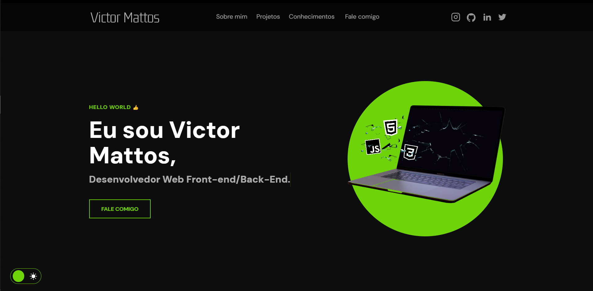

<h1 align="center">Portfólio - Victor Mattos 💻</h1>

<h4 align="center"><a href="https://victormattos.vercel.app">Confira o projeto aqui</a></h4>

---

## 💻 Sobre

Este projeto foi criado para me apresentar como desenvolvedor web front-end.

## 🤯 O site é composto por:

- **Home:** Minha apresentação;
- **Sobre mim:** Um pouco sobre minha trajetória e meu estado atual;
- **Projetos:** Alguns projetos recentes que desenvolvi;
- **Conhecimentos:** As tecnologias que domino;
- **Fale comigo:** Área com meios para contato;
- **Redes:** Minhas redes sociais disponíveis no menu de navegação e no rodapé do site.

## 🏆 Licença

Este projeto está licenciado sob a [MIT License](./LICENSE).
